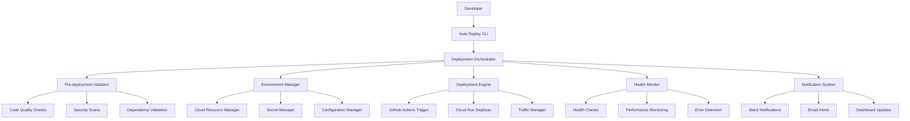

# Design Document

## Overview

The auto-deployment system is designed as a comprehensive, intelligent deployment orchestrator that integrates with existing CI/CD infrastructure while providing enhanced automation, monitoring, and safety features. The system will build upon the current GitHub Actions workflow and Google Cloud Run deployment setup, adding intelligent decision-making, automated rollback capabilities, and comprehensive monitoring.

The design follows a modular architecture with clear separation of concerns, enabling easy maintenance and extensibility. The system will provide both command-line and programmatic interfaces for different use cases.

## Architecture

### High-Level Architecture



### Component Architecture

The system consists of several key components:

1. **Deployment Orchestrator**: Central coordinator that manages the entire deployment lifecycle
2. **Pre-deployment Validator**: Ensures all prerequisites are met before deployment
3. **Environment Manager**: Handles cloud resource provisioning and configuration
4. **Deployment Engine**: Executes the actual deployment process
5. **Health Monitor**: Continuously monitors system health during and after deployment
6. **Notification System**: Provides real-time updates and alerts
7. **Rollback Manager**: Handles automatic rollback scenarios

## Components and Interfaces

### 1. Deployment Orchestrator

**Purpose**: Central control unit that coordinates all deployment activities

**Key Methods**:
- `deploy(environment, options)`: Main deployment entry point
- `validate_prerequisites()`: Checks system readiness
- `execute_deployment_plan()`: Runs deployment steps
- `monitor_deployment()`: Tracks deployment progress
- `handle_failure(error)`: Manages failure scenarios

**Interfaces**:
- CLI interface for manual deployments
- REST API for programmatic access
- GitHub Actions integration

### 2. Pre-deployment Validator

**Purpose**: Validates system state and prerequisites before deployment

**Validation Checks**:
- Code quality metrics (test coverage, linting)
- Security vulnerability scans
- Dependency compatibility
- Cloud resource availability
- Authentication and permissions
- Environment-specific requirements

**Configuration**:
```python
class ValidationConfig:
    min_test_coverage: float = 0.8
    security_scan_required: bool = True
    dependency_check_enabled: bool = True
    cloud_resource_validation: bool = True
```

### 3. Environment Manager

**Purpose**: Manages cloud resources and environment configuration

**Responsibilities**:
- Google Cloud API enablement
- Service account management
- Secret and configuration management
- Resource provisioning
- Environment-specific settings

**Cloud Resources Managed**:
- Cloud Run services
- Firestore databases
- IAM roles and permissions
- Secret Manager secrets
- Monitoring and logging

### 4. Deployment Engine

**Purpose**: Executes the actual deployment process

**Deployment Strategies**:
- Blue-Green deployment for production
- Rolling updates for staging
- Canary deployments for gradual rollouts

**Integration Points**:
- GitHub Actions workflow triggering
- Docker image building and pushing
- Cloud Run service deployment
- Traffic routing management

### 5. Health Monitor

**Purpose**: Monitors system health throughout the deployment process

**Monitoring Capabilities**:
- HTTP endpoint health checks
- Performance metrics tracking
- Error rate monitoring
- Resource utilization tracking
- Custom health check endpoints

**Health Check Configuration**:
```python
class HealthCheckConfig:
    endpoints: List[str] = ["/health", "/api/health"]
    timeout_seconds: int = 30
    retry_attempts: int = 3
    success_threshold: float = 0.95
    performance_threshold_ms: int = 2000
```

### 6. Notification System

**Purpose**: Provides real-time updates and alerts

**Notification Channels**:
- Slack integration
- Email notifications
- Dashboard updates
- GitHub status updates

**Notification Types**:
- Deployment start/completion
- Health check failures
- Rollback triggers
- Performance alerts

### 7. Rollback Manager

**Purpose**: Handles automatic rollback scenarios

**Rollback Triggers**:
- Health check failures
- Performance degradation
- Error rate spikes
- Manual rollback requests

**Rollback Process**:
1. Detect failure condition
2. Identify last stable revision
3. Execute traffic rollback
4. Verify rollback success
5. Notify stakeholders

## Data Models

### Deployment Record

```python
@dataclass
class DeploymentRecord:
    id: str
    timestamp: datetime
    environment: str
    commit_sha: str
    image_tag: str
    revision_name: str
    status: DeploymentStatus
    health_checks: List[HealthCheckResult]
    performance_metrics: Dict[str, float]
    rollback_revision: Optional[str]
    notifications_sent: List[NotificationRecord]
```

### Health Check Result

```python
@dataclass
class HealthCheckResult:
    endpoint: str
    timestamp: datetime
    status_code: int
    response_time_ms: float
    success: bool
    error_message: Optional[str]
```

### Configuration Model

```python
@dataclass
class DeploymentConfig:
    project_id: str
    service_name: str
    region: str
    environment: str
    
    # Resource configuration
    memory: str = "2Gi"
    cpu: str = "2"
    min_instances: int = 1
    max_instances: int = 100
    
    # Deployment strategy
    strategy: DeploymentStrategy = DeploymentStrategy.BLUE_GREEN
    traffic_split_percentage: int = 10
    
    # Health check configuration
    health_check_config: HealthCheckConfig
    
    # Notification configuration
    notification_channels: List[NotificationChannel]
```

## Error Handling

### Error Categories

1. **Pre-deployment Errors**: Configuration issues, missing prerequisites
2. **Deployment Errors**: Build failures, deployment timeouts
3. **Post-deployment Errors**: Health check failures, performance issues
4. **Infrastructure Errors**: Cloud resource issues, permission problems

### Error Handling Strategy

```python
class ErrorHandler:
    def handle_error(self, error: DeploymentError) -> ErrorResponse:
        if error.category == ErrorCategory.PRE_DEPLOYMENT:
            return self.handle_pre_deployment_error(error)
        elif error.category == ErrorCategory.DEPLOYMENT:
            return self.handle_deployment_error(error)
        elif error.category == ErrorCategory.POST_DEPLOYMENT:
            return self.handle_post_deployment_error(error)
        else:
            return self.handle_infrastructure_error(error)
    
    def handle_post_deployment_error(self, error: DeploymentError) -> ErrorResponse:
        # Trigger automatic rollback for critical errors
        if error.severity == ErrorSeverity.CRITICAL:
            self.rollback_manager.initiate_rollback()
        
        # Send notifications
        self.notification_system.send_alert(error)
        
        return ErrorResponse(
            action=ErrorAction.ROLLBACK_INITIATED,
            message=f"Critical error detected: {error.message}",
            recovery_steps=error.recovery_steps
        )
```

### Recovery Mechanisms

- Automatic retry for transient failures
- Rollback to previous stable version
- Circuit breaker pattern for external dependencies
- Graceful degradation for non-critical failures

## Testing Strategy

### Unit Testing

- Individual component testing
- Mock external dependencies
- Test error handling scenarios
- Validate configuration parsing

### Integration Testing

- End-to-end deployment simulation
- Cloud resource interaction testing
- GitHub Actions workflow testing
- Notification system testing

### Performance Testing

- Deployment time benchmarking
- Resource utilization monitoring
- Scalability testing
- Load testing of deployed services

### Security Testing

- Authentication and authorization testing
- Secret management validation
- Network security testing
- Vulnerability scanning

### Test Environment Setup

```python
class TestEnvironment:
    def setup_test_deployment(self):
        # Create isolated test environment
        # Mock cloud resources
        # Setup test data
        # Configure test notifications
        pass
    
    def cleanup_test_deployment(self):
        # Remove test resources
        # Clean up test data
        # Reset configurations
        pass
```

### Automated Testing Pipeline

The testing strategy integrates with the existing CI/CD pipeline:

1. **Pre-commit Testing**: Local validation before code commit
2. **Pull Request Testing**: Automated testing on PR creation
3. **Integration Testing**: Full system testing on merge
4. **Production Testing**: Smoke tests after deployment

### Test Coverage Requirements

- Minimum 85% code coverage for core components
- 100% coverage for critical error handling paths
- Integration test coverage for all deployment scenarios
- Performance test coverage for all supported environments