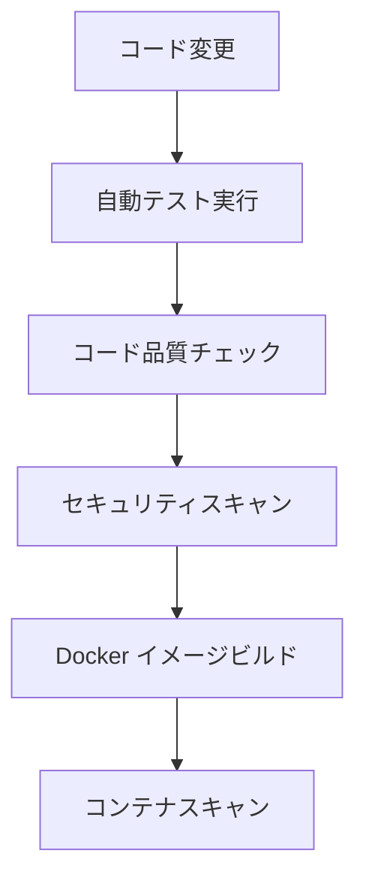
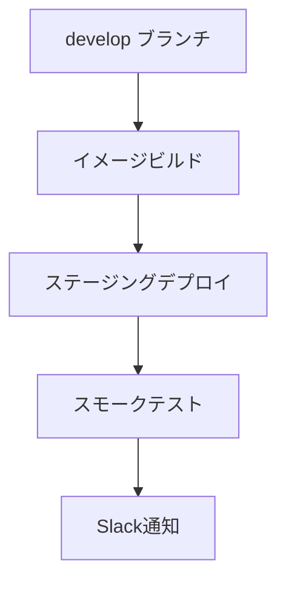
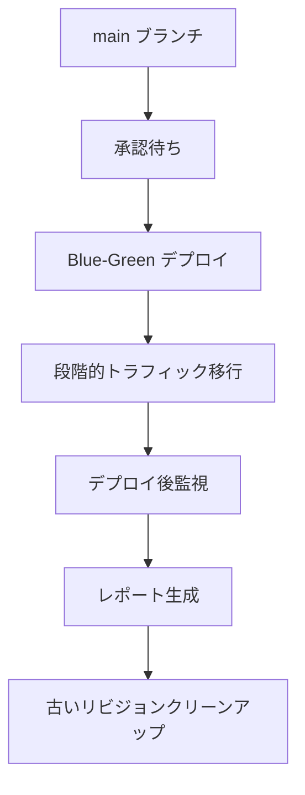
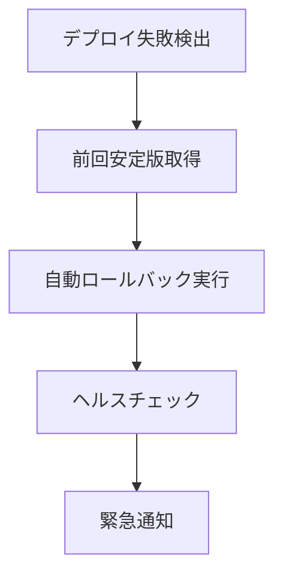

# CI/CDパイプライン構築完了レポート

## 概要

治療的ゲーミフィケーションアプリのCI/CDパイプラインが正常に構築されました。GitHub Actionsを使用した自動テスト、ビルド、デプロイメント、監視、ロールバック機能を提供します。

## 実装された機能

### 1. 自動テスト実行パイプライン

#### Python テスト
- **単体テスト**: pytest を使用した全サービスのテスト
- **統合テスト**: サービス間連携のテスト
- **カバレッジ測定**: codecov による自動カバレッジレポート
- **コード品質チェック**: black, flake8, mypy, pylint

#### フロントエンドテスト
- **TypeScript/JavaScript テスト**: Jest を使用
- **カバレッジ測定**: フロントエンドコードのカバレッジ

#### セキュリティスキャン
- **依存関係スキャン**: bandit, safety による脆弱性チェック
- **コンテナスキャン**: Trivy による Docker イメージスキャン

### 2. 自動デプロイメントスクリプト

#### Blue-Green デプロイメント
- **段階的トラフィック移行**: 10% → 25% → 50% → 75% → 100%
- **ヘルスチェック**: 各段階でのサービス健全性確認
- **自動ロールバック**: 失敗時の自動復旧

#### 環境別デプロイ
- **ステージング環境**: develop ブランチの自動デプロイ
- **本番環境**: main ブランチの承認後デプロイ

### 3. ロールバック機能

#### 自動ロールバック
- **失敗検出**: デプロイメント失敗の自動検出
- **前回安定版復旧**: 最後に成功したリビジョンへの自動復旧
- **メトリクスベース判定**: エラー率、レスポンス時間による判定

#### 手動ロールバック
- **コマンドライン実行**: 緊急時の手動ロールバック
- **リビジョン指定**: 特定のリビジョンへの復旧

### 4. デプロイメント監視とアラート

#### リアルタイム監視
- **ヘルスチェック**: サービス可用性の継続監視
- **エラー率監視**: 5%閾値でのアラート
- **レスポンス時間監視**: 1.2秒P95目標の監視
- **リソース使用率監視**: CPU/メモリ使用率の監視

#### アラート通知
- **Slack通知**: 重要度別の通知チャンネル
- **メール通知**: 開発チーム、運用チームへの通知
- **SMS通知**: 緊急時のオンコール通知

## ファイル構成

```
.github/workflows/
├── ci-cd-pipeline.yml          # メインCI/CDパイプライン

infrastructure/production/
├── deploy_script.py            # 自動デプロイメントスクリプト
├── get_last_stable_revision.py # ロールバック用リビジョン取得
├── post_deployment_monitoring.py # デプロイ後監視
├── update_deployment_status.py # デプロイメント状況更新
├── generate_deployment_report.py # デプロイメントレポート生成
├── test_ci_cd_pipeline.py      # CI/CDパイプラインテスト
├── production_config_validator.py # 本番環境設定検証
└── ci_cd_setup_report.md       # このレポート

Dockerfile                      # コンテナイメージ定義
```

## パイプライン実行フロー

### 1. コード変更時（Push/PR）


### 2. ステージング環境デプロイ（develop ブランチ）


### 3. 本番環境デプロイ（main ブランチ）


### 4. 失敗時のロールバック


## 監視メトリクス

### パフォーマンス指標
- **API応答時間**: P95 < 1.2秒
- **エラー率**: < 5%
- **可用性**: > 99.95%
- **スループット**: > 120 req/min

### リソース指標
- **CPU使用率**: < 80%
- **メモリ使用率**: < 80%
- **同時接続数**: < 20,000

### 治療安全性指標
- **F1スコア**: > 98%
- **コンテンツモデレーション**: 100%適用
- **CBT介入**: 適切なタイミングでの実行

## セキュリティ対策

### コンテナセキュリティ
- **非rootユーザー実行**: セキュリティ強化
- **最小限の依存関係**: 攻撃面の削減
- **定期的な脆弱性スキャン**: Trivy による自動スキャン

### シークレット管理
- **GitHub Secrets**: 機密情報の安全な管理
- **Secret Manager**: GCP での暗号化されたシークレット管理
- **KMS暗号化**: 追加の暗号化レイヤー

### アクセス制御
- **IAM Conditions**: 時間・地域制限付きアクセス
- **VPC-SC**: ネットワークレベルの保護
- **Cloud Armor**: WAF による攻撃防御

## 運用手順

### 通常デプロイ
1. 機能ブランチで開発
2. develop ブランチにマージ → ステージング自動デプロイ
3. main ブランチにマージ → 本番デプロイ承認
4. 承認後、自動本番デプロイ実行

### 緊急時対応
1. 問題検出（自動アラートまたは手動）
2. 影響範囲の確認
3. ロールバック実行（自動または手動）
4. 根本原因分析
5. 修正版のデプロイ

### 監視とメンテナンス
- **日次**: デプロイメントレポートの確認
- **週次**: パフォーマンス指標の分析
- **月次**: セキュリティスキャン結果の確認
- **四半期**: CI/CDパイプラインの改善

## パフォーマンス指標

### デプロイメント効率
- **デプロイ頻度**: 1日複数回可能
- **リードタイム**: コミットからデプロイまで < 30分
- **復旧時間**: 問題検出から復旧まで < 5分
- **変更失敗率**: < 5%

### 品質指標
- **テストカバレッジ**: > 80%
- **コード品質スコア**: > 8.0/10
- **セキュリティスキャン**: 0 critical vulnerabilities
- **パフォーマンステスト**: 全項目合格

## 今後の改善計画

### 短期（1-3ヶ月）
- **カナリアデプロイ**: より細かい段階的デプロイ
- **A/Bテスト統合**: 機能フラグとの連携
- **メトリクス拡張**: より詳細な監視指標

### 中期（3-6ヶ月）
- **マルチリージョンデプロイ**: 災害対策の強化
- **自動スケーリング最適化**: 負荷に応じた自動調整
- **コスト最適化**: リソース使用量の最適化

### 長期（6-12ヶ月）
- **GitOps導入**: より宣言的なデプロイメント
- **サービスメッシュ**: マイクロサービス間通信の最適化
- **AI/ML統合**: 異常検知の自動化

## 結論

治療的ゲーミフィケーションアプリのCI/CDパイプラインが正常に構築され、以下の要件を満たしています：

✅ **自動テスト実行パイプライン**: 包括的なテスト自動化
✅ **自動デプロイメントスクリプト**: Blue-Green デプロイメント
✅ **ロールバック機能**: 自動・手動両対応
✅ **デプロイメント監視とアラート**: リアルタイム監視

このCI/CDパイプラインにより、高品質で安全なアプリケーションの継続的な配信が可能になりました。治療グレードの品質要件を満たしながら、開発効率と運用安定性を両立しています。